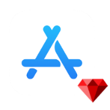

<div align="center">
  

  <h1>App Store Connect for Ruby</h1>

[](https://github.com/kyledecot/app_store_connect/actions/workflows/default.yml)
</div>


A Ruby interface to the [App Store Connect API](https://developer.apple.com/app-store-connect/api/)

## Installation

Add this line to your application's Gemfile:

```Ruby
gem 'app_store_connect'
```

And then execute:

```Bash
$ bundle
```

Or install it yourself as:

```Bash
$ gem install app_store_connect
```

## Usage

```ruby
AppStoreConnect.config = {
  issuer_id: 'issuer_id',
  key_id: 'key_id',
  private_key: File.read(File.new("/Path/AuthKey.p8"))
}

app_store_connect = AppStoreConnect::Client.new

app_store_connect.apps 
app_store_connect.app(id: '1234')
app_store_connect.builds(id: '1234')
```

### Create Bundle ID

```ruby
app_store_connect.create_bundle_id(
  name: 'Example', 
  identifier: 'com.kyledecot.Example', 
  platform: 'IOS'
) 
```

### Sales Reports

```ruby
app_store_connect.sales_reports(
  filter: {
    report_type: 'SALES',
    report_sub_type: 'SUMMARY',
    frequency: 'DAILY',
    vendor_number: '123456'
  }
)
```

### Fetch All Devices

```ruby

devices = app_store_connect.devices
puts JSON.pretty_generate(devices)

```

### Register a New Device

```ruby
created_device = app_store_connect.create_device(
    name: 'name',
    platform: 'IOS',
    udid: 'udid'
  )

puts JSON.pretty_generate(created_device)
```

### Update an App Store Version

```ruby
app_store_connect.update_app_store_version(
  id: '<app-store-version-id>', 
  version_string: '1.0'
)
```

### Link a Build to an App Store Version

```ruby
app_store_connect.update_app_store_version_build(
  id: '<app-store-version-id>', 
  build_id: '<build-id>'
)
```

### Create a Review Submission Item

```ruby
app_store_connect.create_review_submission_item(
  relationships: {
    reviewSubmission: {
      data: {
        id: '<review-submission-id>', 
        type: 'reviewSubmissions'
      }
    },
    appStoreVersion: {
      data: {
        id: '<app-store-version-id>', 
        type: 'appStoreVersions'
      }
    }
  }
)
```

### Create In-App Purchase Price Schedule

```ruby
app_store_connect.create_in_app_purchase_price_schedule(
  relationships: {
    manual_prices: {
      data: [
        {
          type: 'inAppPurchasePrices',
          id: '${price1}'
        }
      ]
    },
    in_app_purchase: {
      data: {
        type: 'inAppPurchases',
        id: '<in-app-purchase-id>'
      }
    }
  }, 
  included: [
    {
      type: 'inAppPurchasePrices',
      id: '${price1}',
      attributes: {
        startDate: nil
      },
      relationships: {
        inAppPurchaseV2: {
          data: {
            type: 'inAppPurchases',
            id: '<in-app-purchase-id>'
          }
        },
        inAppPurchasePricePoint: {
          data: {
            type: 'inAppPurchasePricePoints',
            id: '<price-point-id>'
          }
        }
      }
    }
  ]
)
```

## FAQ

### How to understand the `devices, sales_reports, create_bundle_id` keyword seen in the demo?

It's function key from `schema.json` file.

### How to understand `()` in the demo, and when should use it? eg: `create_bundle_id()`, `sales_reports()`

`()` is mean: you have mapped to `http_body_type` in file `schema.json`

### How to set this content in `()`

`http_body_type` have a value type. Based on this value, we can find the definition of the relevant configuration in the source code of ruby.

### How to include related resources?

```ruby
app_store_connect.in_app_purchase(id: 123, include: 'appStoreReviewScreenshot,pricePoints')
```

### How to filter fields?

```ruby
app_store_connect.in_app_purchase(id: 123, fields: 'name,productId')
```

## Development

After checking out the repo, run `bundle install` to install dependencies. Then, run `rake spec` to run the tests. You can also run `rake console` for an interactive prompt that will allow you to experiment.

## Contributing

Bug reports and pull requests are welcome on GitHub at https://github.com/kyledecot/app_store_connect.

## License

The gem is available as open source under the terms of the [MIT License](https://opensource.org/licenses/MIT).
